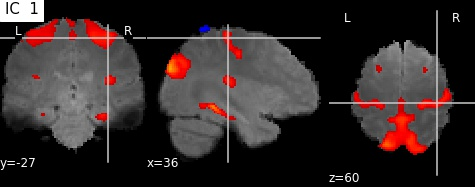

# Temporal ICA (tICA) HCP resting-state fMRI data
 [](https://github.com/dwyl/esta/issues) [](http://hits.dwyl.com/BTajini/tICA)   

## Website
For more informations, please visit the websites below:

- Full version with post-processing (788 subjects) :

  https://btajini.github.io/tICA/tICAv3.html 

- Full version without post-processing (200 subjects) : 

  https://btajini.github.io/tICA/tICA.html
  

#### Computing tICA from HCP resting state fMRI data using Functional Modes DiFuMo atlas.

This repository includes the interpretation of the masking block of HCP resting state data in our recent paper:

- Independent Component (IC) 1 (Static view) <br>

 <br>
**Figure 1** - IC 1 (Static view)

- Independent Component (IC) 1 (Interactive view) <br>

 <br>
**Figure 2** - IC 1 (Interactive view) - <a href="https://btajini.github.io/tICA/tICA_filesv3/imagesv3/Mix_mat_ic_1.html" >Link to the Interactive view</a>
<br>
  
## Link
Paper in arXiv version:  [[PDF](https://arxiv.org/abs/2107.06104v2)] <br>
Paper in HAL version: [[PDF](https://hal.archives-ouvertes.fr/hal-03284313v1)] <br>
## Citation
If you find this repository useful in your research, please cite:
```
@inproceedings{tajini2021functional,
  address={Cham},
  author={Tajini, Badr and Richard, Hugo and Thirion, Bertrand},
  booktitle={"Medical Image Computing and Computer Assisted Intervention -- MICCAI 2021"},
  editor={de Bruijne, Marleen and Cattin, Philippe C. and Cotin, St{\'e}phane and Padoy, Nicolas and Speidel, Stefanie and Zheng, Yefeng and Essert, Caroline},
  isbn={978-3-030-87196-3},
  pages={491--500},
  publisher={Springer International Publishing},
  title={Functional Magnetic Resonance Imaging data augmentation through conditional ICA},
  year={2021}
}
```
